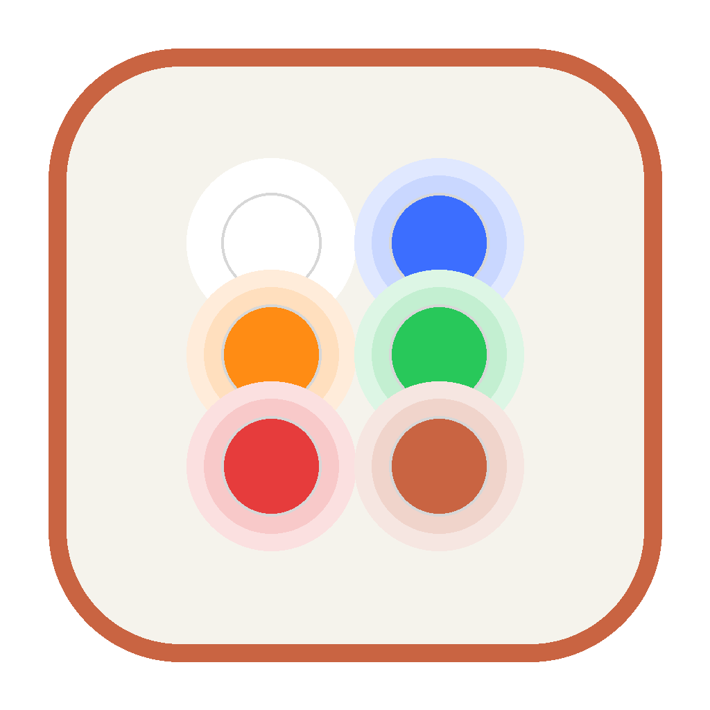

<div align="center">



# codexpad

**Drive OpenAI's Codex Micro macropad from Claude Code.**

Blue while Claude works · amber when it needs you · green when it's done

[](LICENSE)


[](PROTOCOL.md)

<br>
<sub>The control panel mirroring a working session, a blocked approval, a finished run, the mic opening, and rainbow mode.</sub>

</div>

---

The [Codex Micro](https://openai.com/supply/co-lab/work-louder/)'s six frosted
Agent Keys light up to show what your Codex chats are doing. **codexpad makes
them do the same for Claude Code sessions** — each session claims a key, and
the one glance that matters is amber: *Claude is waiting on you.*

Along the way it documents the device's vendor HID protocol in what is, as
far as we know, its first public description: [`PROTOCOL.md`](PROTOCOL.md),
with a hardware-verification status on every claim, raw captures as evidence
in [`captures/notifications.md`](captures/notifications.md), and
[`tools/probe.py`](tools/probe.py) so you can check the document against
your own pad instead of trusting it.

> Unofficial and unaffiliated — not endorsed by OpenAI or Work Louder.
> Written against firmware `v0.4.1`; a firmware update may break any of it.

## What lights up when

| Claude Code event | Agent Key |
|---|---|
| Session starts | white, dim |
| You submit a prompt | blue, breathing |
| Claude needs approval or input | **amber, breathing** |
| Turn completes | green |
| Turn fails on an API error | red |
| Session ends | off |

Each session is identified by its working directory — Desktop gives every
session an isolated worktree, so the mapping needs no bookkeeping. A seventh
session evicts the least recently used key. Pressing a green or red key
acknowledges it; the dial trims brightness and clears the board.

## Install

### macOS — Codexpad.app

One script builds a small app that behaves like the vendor's client:
**opening it is always the fix.** It stops strays, starts the daemon (with
root, via a passwordless rule for one fixed command), supervises daemon and
panel so they restart if they die, and opens the control panel.

```bash
git clone https://github.com/shahcolate/codexpad && cd codexpad
pip install -r requirements.txt
./make_login_app.sh "$(which python)"
```

Two one-time clicks in System Settings (the script prints them):

1. **Privacy & Security → Input Monitoring** → **+** → `~/Applications` →
   **Codexpad** → toggle on. *(Remove any stale Codexpad row first —
   rebuilding the app voids old grants.)*
2. **General → Login Items** → **+** → **Codexpad**.

Then `open ~/Applications/Codexpad.app`. Put the pad in **wired mode**
(hold the front-left touch control 3s, tap until the ring is **white**) and
watch `tail -f /tmp/codexpad.daemon.log` for `codexpad ready`. Finally, in
the panel, click **Install hooks** and fully restart Claude Code.

### Anywhere else — one command

```bash
python -m codexpad
```

starts the daemon and opens the panel at **http://127.0.0.1:8378**; the
setup card walks you through the rest with buttons. On Linux the daemon
usually just opens the device (udev permitting) with none of the macOS
ceremony.

### If macOS fights you

Some Macs (observed on an anaconda install) require **root and Input
Monitoring at the same time**. The [field guide](#field-guide) has the
truth table and every fallback, from `sudo python -m codexpad.daemon` to a
one-word shell function.

## The control panel

<div align="center">

</div>

- **Your pad, live** — a mockup mirroring the hardware in real time: which
  session owns each key, its state and effect, mic open/closed, master
  brightness (tracks the physical dial).
- **Colours & effects** — pickers, effect menus and brightness per state,
  five presets (Classic, Matrix, Sunset, Ocean, Mono), **Try** on any key
  you click, a **Demo** cycle. **Save** writes `~/.codexpad.json` and the
  daemon repaints live.
- **Setup** — a health checklist (hidapi → device → daemon → hooks →
  runs-at-login) where every ❌ has a button that fixes it, including
  **Install hooks** (merges into `~/.claude/settings.json`, backup first)
  and a **Start daemon** that uses the passwordless root wrapper when
  installed.
- 🌈 **Rainbow** — all six keys run the device's own rainbow effect until
  you press the dial.

## The hardware, mapped

Input flows back — the daemon reads the pad's own notifications:

| Control | Built-in action |
|---|---|
| Agent Key (`AG00`–`AG05`) | acknowledge that session — green/red returns to dim idle |
| Dial rotate (`ENC_CW`/`ENC_CC`) | brightness trim, one step per detent |
| Dial press (`ENC_CLK`) | acknowledge everything finished |
| Mic bar (`ACT10`+`ACT11`) | hold = push-to-talk, double-press = latch; fires `MIC_ON`/`MIC_OFF` |
| Command Keys (`ACT06`–`ACT09` ⚡✓✗⑂, `ACT12` ✦) | bindable |
| Stick flick (`STICK_N/E/S/W`) | bindable |

An amber key deliberately can't be answered from the pad — Claude Code has
no remote-approval interface, so clearing it would lie. What any control
*can* do is run something of yours, via the `commands` table (in the panel
or `~/.codexpad.json`), executed with `CODEXPAD_KEY`, `CODEXPAD_CWD` and
`CODEXPAD_STATE` in the environment:

```json
"commands": {
  "ACT06":   "open -a 'Claude'",
  "MIC_ON":  "shortcuts run 'Start Dictation'",
  "MIC_OFF": "shortcuts run 'Stop Dictation'",
  "STICK_N": "say up"
}
```

**The mic bar is a trigger, not a microphone**: two switches folded into one
logical key. Hold it and it's open for exactly the hold; double-press
latches until the next double-press. The ambient ring lights red while open
(`mic_color`) — confirmed on hardware: `v.oai.rgbcfg`'s `ambient` zone takes
the same split partial updates as the key lighting, with `c`, `e` and `b`
behaving as documented. That is one zone, three fields and one effect value,
observed at one colour; the `keys` zone, `s`/`m` and every non-solid effect
are untested (PROTOCOL.md §5.3). If the daemon runs as root, your bindings
run as root too — keep them to things you'd sudo anyway.

## Claude or Codex — the handoff

The single most useful thing hardware testing taught us: **check the
transport first.** What was observed here, repeatedly, on one pad and one
Mac: with a Bluetooth bond in place the pad kept returning to BLE, where it
drove the ChatGPT app happily while being *completely absent from the USB
bus* — `system_profiler` empty, nothing for codexpad to open. Wired mode
only held after the pairing was forgotten on the host. So if you're running
both stacks: **Forget the pad in Bluetooth settings while you want it
wired**, and use the ring colour as your mode tell — blue is BLE, white is
wired.

Two caveats, because this is the part most likely to be a quirk of that
setup rather than the device: we never tested whether the ChatGPT app can
*also* drive the pad over USB (it may well — that would make "blue = Codex,
white = Claude" a property of our configuration, not a design), and we never
tried to hold a USB and a BLE host at once, so "one bus at a time" is what
we saw, not something we established. If you've run either experiment,
[open an issue](../../issues) — it settles the question.

Within USB there's also a soft handoff — **⇆ Hand pad to Codex** in the
panel (or `{"cmd":"pause"}` on the socket) blanks codexpad's lights and
silences it while still *tracking* your sessions; **⇤ Take pad back**
repaints them instantly. True simultaneous use needs the vendor's layer
system — roadmap.

## Configuration

Everything lives in `~/.codexpad.json` (defaults: `codexpad/config.py`):

```json
{
  "states": {
    "working": {"color": "0000FF", "effect": 4, "brightness": 1.0}
  },
  "commands": {"MIC_ON": "shortcuts run 'Start Dictation'"},
  "mic_color": "FF0000"
}
```

Effects: `0` off, `1` solid, `2` snake, `3` rainbow, `4` breath, `5`
gradient, `6` shallow breath — `1` is confirmed on hardware, the rest come
from the vendor client's enumeration and haven't each been exercised.
Colours are `RRGGBB` — verified, no byte swap. The daemon's socket takes commands directly: `rainbow`, `off`,
`reload`, `pause`, `resume`, `status`, `trim`, e.g.
`printf '{"cmd":"rainbow"}' | nc -U /tmp/codexpad.sock`.

## How it works

```
Claude Code hook ──stdin JSON──▶ notify.py ──unix socket──▶ daemon.py ◀──vendor HID──▶ Codex Micro
                                                                ▲
                                              control panel ────┘  (reload · preview · pause · status)
```

- **The daemon holds the HID handle** — opening per hook is slow and races.
  It survives unplug/replug (reconnects and repaints) and waits for the pad
  when absent.
- **`notify.py` never fails** — every error is swallowed, so a dead daemon
  can't break a Claude Code turn. `CODEXPAD_DEBUG=1` logs to
  `/tmp/codexpad.log`.
- **The daemon never reassembles RPC replies** — notifications and replies
  share report ID `0x06` (PROTOCOL.md §2.2), but notifications parse
  standalone and reply fragments never do, so anything unparseable is
  dropped. RPC that needs replies lives in `probe.py`.

## The protocol work

[`PROTOCOL.md`](PROTOCOL.md) documents the `kbd-1.0-codex-micro` from
observation of the author's own device: the 64-byte frame format, the
abbreviated JSON-RPC envelope, notification schemas for every control, the
lighting methods, the physical key map, and the transport behaviour.

Verified on hardware: frame layout and the 61-byte body limit, response
chunking, the envelope's silent `id`-key failure mode, all thirteen key
identifiers and their physical positions, press/release patterns, the
analog stick's schema *and* orientation, colour encoding, per-thread
lighting with split partial updates, single-zone ambient-ring control, and
the pad's identical HID-over-GATT identity on Bluetooth. Two firmware
observations were reported to Work Louder before publication (§7). No
vendor code is included or redistributed; the goal is interoperability.

All of it is one device, one host and firmware `v0.4.1`, so read §6's status
column before relying on a claim: it separates what was exercised from what
is documented-but-untested or inferred, and the untested list is not short.
`tools/probe.py` exists so you can promote a row against your own pad.

## Field guide

Every symptom and fix below was hit and cleared on real hardware; the middle
column is our best explanation of *why*, which is interpretation rather than
something we instrumented. Start with the transport — most "broken" states
are the pad being on the wrong bus:

| Symptom | It means | Fix |
|---|---|---|
| Pad lights up only when the ChatGPT app opens | It's on **Bluetooth**; the vendor app drives it over BLE | Quit ChatGPT, *Forget* the pad in Bluetooth settings, tap to the **white ring** |
| `probe.py enumerate` lists it but nothing can open it | Check the bus tag — BLE HID looks identical to USB | `[BLUETOOTH]` → tap to wired; want `[USB]` |
| Flashes blue when unplugged; "wired" doesn't stick | BLE advertising; the mode reverts on power loss, bonds dominate | Re-check for white after any unplug |
| Charges, solid indicator, `system_profiler SPUSBDataType` empty | No USB data path | Data cable (the boxed one), direct port — or it's in BLE mode |
| `open failed` with the pad on `[USB]` | macOS Input Monitoring | Grant terminal **and** python; on stubborn Macs see the truth table below |
| Daemon under launchd waits forever, pad wired | launchd can't hold an Input Monitoring grant | Use Codexpad.app (a granted app), not a plist |
| `permission denied: /tmp/codexpad.daemon.log` | Root-owned log from earlier sudo runs breaks user redirects | `sudo rm -f` it; current wrappers log as root by design |
| One key lights by itself; panel says daemon unreachable | A **stale daemon build** misreads panel commands as hook messages | Restart the daemon from the up-to-date repo; the panel names mixed builds |
| Keys stay lit after tests | The device keeps its last lighting | Any daemon start blanks; `--off`; press green/red keys |
| Hooks don't fire | Claude Code reads settings at launch | Fully quit and reopen; Desktop: **Code** tab + **Local** environment |

**The macOS permission truth table** (some Macs need root *and* Input
Monitoring at once — diagnose with `python tools/probe.py color 0 00FF00`
with and without `sudo`):

| launch | root | Input Monitoring | opens the pad |
|---|---|---|---|
| Codexpad.app (granted) → sudo wrapper | yes | yes (the app's grant) | ✅ |
| `sudo python -m codexpad.daemon` in a granted terminal | yes | yes (inherited) | ✅ |
| plain `python -m codexpad` | no | yes | ❌ on these Macs |
| root LaunchDaemon (`service.sh`) | yes | no | ❌ |

Always-works fallback: `sudo python -m codexpad.daemon` in a granted
terminal. One-word version, once the wrapper exists:

```bash
cat >> ~/.zshrc <<'EOF'
codexpad() { sudo -n /usr/local/bin/codexpad-daemon & (cd ~/codexpad && python -m codexpad.app --no-daemon >/dev/null 2>&1 &); sleep 1; open http://127.0.0.1:8378; }
EOF
```

## Roadmap

- [x] Protocol: frames, envelope, notifications, lighting, key map, stick orientation, `rgbcfg` ambient, BLE HID identity
- [x] Buttons, dial, stick flicks, mic state machine with ring indicator
- [x] Control panel, presets, hook installer, health checks
- [x] Codexpad.app: self-healing launch, login start, icon
- [x] Codex handoff (pause/resume) + the transport discovery
- [ ] Simultaneous Codex + Claude via the vendor's layer system
- [ ] Native menu-bar app (panel without the browser)
- [ ] Joystick session navigation; `keys` zone; `s`/`m` fields
- [ ] Windows support (Linux untested but expected to work)

## License & scope

MIT — see [LICENSE](LICENSE). This documents observable device behaviour,
independently implemented, for interoperability. If Work Louder or OpenAI
ship an official SDK, use that instead.
