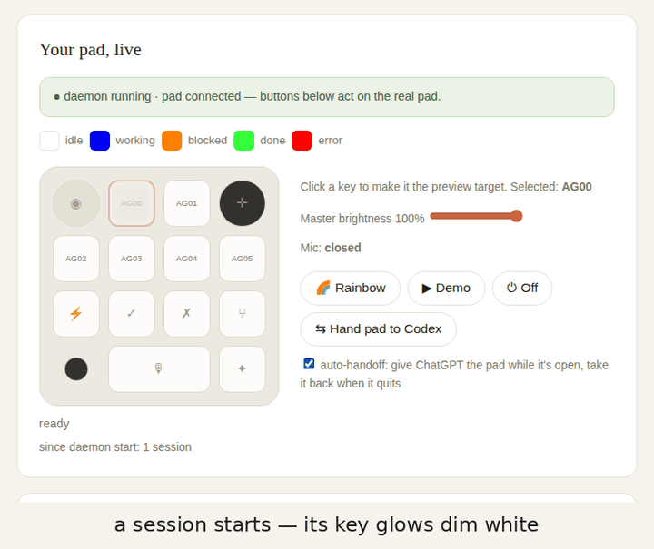
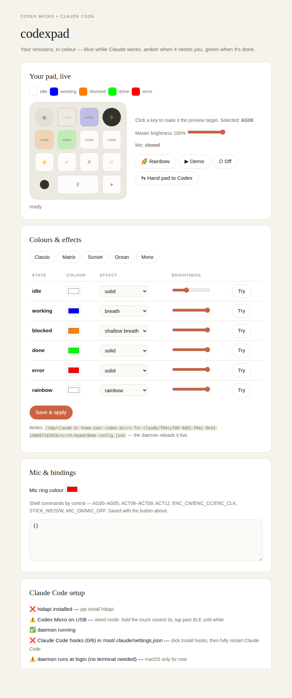

<div align="center">

# codexpad

**Drive OpenAI's Codex Micro macropad from Claude Code.**

Blue while Claude works · amber when it needs you · green when it's done

[](LICENSE)


[](PROTOCOL.md)

<br>
<sub>The control panel mirroring a working session, a blocked approval, a finished run, the mic opening, and rainbow mode.</sub>

</div>

---

The [Codex Micro](https://openai.com/supply/co-lab/work-louder/)'s six frosted
Agent Keys light up to show what your Codex chats are doing. **codexpad makes
them do the same for Claude Code sessions** — and documents the device's
vendor HID protocol along the way, in what is (as far as we know) its first
public description: [`PROTOCOL.md`](PROTOCOL.md), with a hardware-verification
status on every claim and the raw captures to back them in
[`captures/notifications.md`](captures/notifications.md).

> Unofficial and unaffiliated — not endorsed by OpenAI or Work Louder.
> Written against firmware `v0.4.1`; a firmware update may break any of it.

## What lights up when

| Claude Code event | Agent Key |
|---|---|
| Session starts | white, dim |
| You submit a prompt | blue, breathing |
| Claude needs approval or input | **amber, breathing** |
| Turn completes | green |
| Turn fails on an API error | red |
| Session ends | off |

Each session gets its own key, identified by its working directory — Desktop
gives every session an isolated worktree, so the mapping needs no bookkeeping.
A seventh session evicts the least recently used. The amber is the one that
earns the hardware; everything else is decoration.

## Quickstart

```bash
git clone https://github.com/shahcolate/codex-micro-for-claude && cd codex-micro-for-claude
pip install -r requirements.txt
python -m codexpad
```

That one command starts the daemon and opens the control panel at
**http://127.0.0.1:8378**. Its setup card walks you through the rest with
buttons, not instructions:

1. **Wired mode** — hold the pad's front-left touch control 3s, tap past the
   three BLE channels until the underglow turns white.
2. **Input Monitoring** (macOS, one time) — grant it to your terminal, then
   fully quit and relaunch the terminal. The pad exposes a keyboard
   collection, so macOS gates opening it.
3. Click **Install hooks**, then fully quit and reopen Claude Code.
4. Click **Run at login** — the daemon becomes a background service that
   starts at boot and restarts if it dies. **No terminal needs to stay open.**

Send Claude a prompt. The key turns blue.

<div align="center">

</div>

## The control panel

`python -m codexpad` serves a local-only page with:

- **Your pad, live** — a mockup mirroring the hardware in real time: which
  session owns each key, its state and effect, mic open/closed, master
  brightness (it tracks the physical dial).
- **Colours & effects** — pickers, effect menus and brightness per state,
  five presets (Classic, Matrix, Sunset, Ocean, Mono), **Try** on any key you
  click, and a **Demo** cycle. **Save** writes `~/.codexpad.json` and the
  daemon reloads it live.
- **Setup** — a health checklist (hidapi → device → daemon → hooks →
  background service) where every ❌ has a button that fixes it.
- 🌈 **Rainbow** — all six keys run the device's own rainbow effect until you
  press the dial.

## Sharing the pad with Codex

The ChatGPT desktop app and codexpad both want to drive the same six LEDs, so
the model is an explicit **handoff**, not a fight:

- **⇆ Hand pad to Codex** — codexpad blanks its lights and goes silent (it
  keeps *tracking* your Claude sessions in memory), and the vendor client
  drives the pad.
- **⇤ Take pad back** — your Claude session states repaint instantly.

Terminal equivalent: `printf '{"cmd":"pause"}' | nc -U /tmp/codexpad.sock`
(and `resume`). True simultaneous use is on the roadmap — it needs the
vendor's layer system, which nobody has characterised yet.

## The hardware controls

Input flows back from the pad — the daemon reads the device's own
notifications and acts on them:

| Control | Built-in action |
|---|---|
| Agent Key (`AG00`–`AG05`) | acknowledge that session — green or red returns to dim idle |
| Dial rotate (`ENC_CW`/`ENC_CC`) | brightness trim, one step per detent |
| Dial press (`ENC_CLK`) | acknowledge everything finished at once |
| Mic bar (`ACT10`+`ACT11`) | hold = push-to-talk, double-press = latch; fires `MIC_ON`/`MIC_OFF` |
| Command Keys (`ACT06`–`ACT09` ⚡✓✗⑂, `ACT12` ✦) | nothing built in — bind them |
| Stick flick (`STICK_N/E/S/W`) | nothing built in — bind them |

An amber key deliberately can't be answered from the pad — Claude Code has no
remote-approval interface, so clearing it would lie about the session. What a
press *can* do is run something of yours: the `commands` table (in the app,
or `~/.codexpad.json`) binds any identifier to a shell command, run detached
with `CODEXPAD_KEY`, `CODEXPAD_CWD` and `CODEXPAD_STATE` in the environment:

```json
"commands": {
  "ACT06":   "open -a 'Claude'",
  "MIC_ON":  "shortcuts run 'Start Dictation'",
  "MIC_OFF": "shortcuts run 'Stop Dictation'",
  "STICK_N": "say up"
}
```

The mic bar sits on two switches folded into one logical key: **hold** it and
the mic is open for exactly the hold; **double-press** latches it until the
next double-press. The ambient ring lights red while open (colour
configurable) — confirmed on hardware, and the first characterisation of the
device's `v.oai.rgbcfg` zone-lighting method.

## How it works

```
Claude Code hook ──stdin JSON──▶ notify.py ──unix socket──▶ daemon.py ◀──vendor HID──▶ Codex Micro
                                                                ▲
                                              control panel ────┘  (reload · preview · pause · status)
```

Three deliberate choices:

- **The daemon holds the HID handle** — opening per hook invocation is slow
  and races against itself. Install it as a login service and forget it.
- **`notify.py` never fails** — every error is swallowed, so a dead daemon or
  an unplugged pad can't break a Claude Code turn. `CODEXPAD_DEBUG=1` logs to
  `/tmp/codexpad.log`.
- **The daemon never reassembles RPC replies** — notifications and replies
  share report ID `0x06` ([`PROTOCOL.md`](PROTOCOL.md) §2.2), but every
  notification parses standalone and reply fragments never do, so anything
  unparseable is dropped instead of accumulated. RPC that needs replies lives
  in `tools/probe.py`.

## The protocol work

[`PROTOCOL.md`](PROTOCOL.md) documents the `kbd-1.0-codex-micro`'s vendor HID
protocol from observation of the author's own device: the 64-byte frame
format, the abbreviated JSON-RPC envelope, notification schemas for every
control, the lighting methods, and the physical key map. Every claim carries
a verification status, and [`tools/probe.py`](tools/probe.py) is the
instrument that produced it — `enumerate`, `listen`, `version`, `call`,
`color` — so anyone with the hardware can check the document rather than
trust it.

Verified on hardware so far: the frame layout and 61-byte body limit,
response chunking, the envelope's silent `id`-key failure mode, all thirteen
key identifiers and their physical positions, press/release patterns, the
analog stick's schema *and* orientation, colour encoding (`0xRRGGBB`, no
swap), per-thread lighting with split partial updates, and single-zone
ambient-ring control. Two firmware observations were reported to Work Louder
before publication (§7). No vendor code is included or redistributed; the
goal is interoperability, not substitution.

## Customising by hand

Everything the app edits lives in `~/.codexpad.json`:

```json
{
  "states": {
    "working": {"color": "0000FF", "effect": 4, "brightness": 1.0}
  },
  "commands": {"MIC_ON": "shortcuts run 'Start Dictation'"},
  "mic_color": "FF0000"
}
```

Effects: `0` off, `1` solid, `2` snake, `3` rainbow, `4` breath, `5` gradient,
`6` shallow breath. Anything you don't override keeps its default
(`codexpad/config.py`). The daemon's socket takes commands directly:
`rainbow`, `off`, `reload`, `pause`, `resume`, `status`, `trim`.

## Troubleshooting

**`open failed` on macOS.** Input Monitoring. In System Settings → Privacy &
Security → Input Monitoring, enable **both** your terminal **and** your
`python` binary (add it with **+** → Cmd+Shift+G → the path from
`python -c "import sys; print(sys.executable)"`), then fully quit and
relaunch the terminal. If `python tools/probe.py enumerate` lists the
device, it's this permission — not the cable, and not another app "holding"
it. Stubborn cases: reboot, or `tccutil reset ListenEvent` and re-grant.

**If macOS still won't grant it**, skip the fight — install the daemon as a
root system service instead (root bypasses the check entirely):

```bash
sudo ./service.sh "$(which python)"
```

Starts at boot, restarts if it dies, waits for the pad, no terminal, no
Input Monitoring. `sudo ./service.sh remove` to uninstall. After running
under plain `sudo`, clean up with `sudo rm -f /tmp/codexpad.sock` (the
daemon says so when this is the issue).

**Device doesn't enumerate.** BLE mode (USB charges but doesn't enumerate) or
a charge-only cable. See wired mode above. **The tell: if the pad flashes
blue when unplugged, it's in BLE mode** — and it appears to fall back to BLE
after losing power, so re-check wired mode after any unplug. A running
daemon reconnects and repaints by itself once the pad is back in wired mode.

**Hooks don't fire.** Run `/hooks` inside Claude Code — your events should be
listed with source `User`. If not, fully quit and reopen the app. Desktop:
use the **Code** tab with a **Local** environment; cloud and SSH sessions run
hooks remotely and can't reach your pad.

**The app misbehaves after a `git pull`.** Restart the daemon — the app
detects version mismatches and says so. A stale daemon build also misreads
app commands as hook messages (one key mysteriously lights white). Beware
stale copies of this repo: early drafts like `~/codexpad`, or a nested clone.

**Keys stay lit.** The device keeps its last lighting. Any daemon start
blanks all six; `python -m codexpad.daemon --off` is the one-shot; pressing a
green or red key clears it.

## Roadmap

- [x] Capture the Command Key identifiers — `ACT06`–`ACT12`, physically mapped
- [x] Stick orientation (`a=0` down, counter-clockwise) and flick events
- [x] Characterise `v.oai.rgbcfg` `ambient` (`keys` zone, `s`/`m` still open)
- [x] Confirm `ACT` releases · background service · Codex handoff
- [ ] Simultaneous Codex + Claude via the vendor's layer system
- [ ] Session navigation on the joystick — flicks fire, nothing consumes them yet
- [ ] Windows support (Linux untested but expected to work)

## License

MIT — see [LICENSE](LICENSE). Documentation of observable device behaviour,
independently implemented; if Work Louder or OpenAI ship an official SDK,
use that instead.
